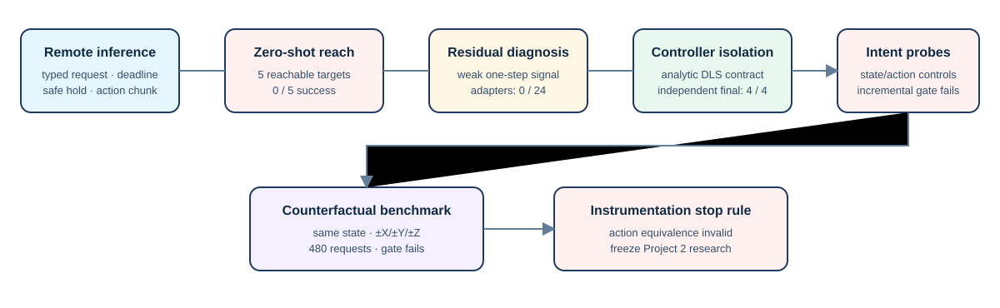

# Final Project Summary — Safe VLA Cross-Embodiment Deployment and Failure Attribution

## Executive summary

This project built and evaluated a safety-bounded runtime around the official
OpenPI π0.5 DROID policy, then tested whether its frozen robot-facing action
could transfer to a Panda MuJoCo reach task. The runtime worked: typed DROID
requests, WebSocket serving, process-owned deadlines, safe holds, action-chunk
ownership, first-action execution, explicit bridge limits, and re-observation
all ran under measured conditions. The transfer claim did not: frozen π0.5
DROID action achieved 0/5 zero-shot reach successes and no frozen residual
adapter achieved held-out task success.

The important outcome is the causal evidence chain, not a polished failure.
Independent DLS controls established that the Panda low-level velocity contract
can reach new targets (4/4), whereas exact-same-state counterfactual probes
showed that final DROID action did not provide the required held-out
task-conditioned Cartesian information beyond state-only and shuffled controls.
The final upstream-latent check stopped before data collection because its
instrumentation altered action semantics. It is correctly recorded as an
instrumentation validity failure—not proof that upstream representations lack
semantics. The project then freezes rather than tuning around its negative
result.

## Causal evidence chain

1. **Deployment boundary:** verified checkpoint/server and implemented typed
   observation, process ownership, 5-s deadline, reconnect, safe hold, and
   bridge-limited execution.
2. **Task claim test:** zero-shot Panda reach was 0/5 despite stable requests.
3. **Narrower diagnosis:** identity interpretation had weak one-step direction
   signal; frozen residual adapters reduced final distance but remained 0/24.
4. **Control isolation:** analytic DLS velocity and direct IK both reached 4/4
   on an independent Stage 20B final split, isolating the main issue above the
   tested low-level Panda control contract.
5. **Information test:** target-level probing was confounded by direction
   concentration, so Stage 22 introduced identical-state balanced six-way
   counterfactual groups. The final action still failed the locked incremental
   information gate.
6. **Stop boundary:** Stage 23's only allowed latent instrumentation did not
   preserve final action within tolerance; no full latent test was valid. The
   project stopped rather than changing features or searching layers.

## Demonstrated capabilities

- Remote policy deployment and typed VLA I/O integration.
- Deadline-aware ownership and failure handling around a synchronous policy
  transport.
- Explicit action-schema adaptation with joint limits and first-action control.
- Headless MuJoCo Panda evaluation, geometric oracle controls, and held-out
  experiment design.
- Preregistered baselines, seed reporting, leakage controls, counterfactual
  same-state testing, and stop rules.

## Explicit non-claims

No real Panda hardware was controlled. No camera is calibrated. No simulation
result establishes sim-to-real transfer, safety certification, or zero-shot
cross-embodiment skill. DLS and IK are analytic simulator references, not
learned policies. Stage 23 does not justify a claim about whether upstream
π0.5 semantics are present or absent.

## Portfolio-ready wording

**Resume / BOSS (2–3 lines):** Built a safety-bounded remote OpenPI π0.5
inference runtime with typed DROID observations, process-owned 5-s deadlines,
safe holds, action-chunk control, and an explicit DROID→Panda MuJoCo bridge.
Designed preregistered zero-shot, residual-adaptation, controller-isolation,
and counterfactual intent evaluations; closed the transfer hypothesis via
held-out controls and a documented stop rule rather than post-hoc tuning.

**Longer interview description:** I treated the policy server as an untrusted
remote component rather than a robot controller: the runtime owns validation,
timeouts, action limits and execution cadence. Once the obvious Panda transfer
failed, I narrowed the question with one-step diagnosis and frozen residual
adapters, then separated controller feasibility from VLA transfer using an
analytic DLS reference. When a conventional probe was vulnerable to direction
imbalance, I replaced it with same-state ±axis counterfactual groups and
state/shuffle controls. The final frozen action still had no reliable
incremental intent signal, so I froze the project. That is the result I would
defend: reliable systems engineering plus honest experimental boundaries—not a
claim of real-robot or zero-shot success.

## Final status

Project 2 is complete and frozen for experimentation. Its next value-adding
work is presentation packaging. The follow-on Project 3 is planned separately
to demonstrate a trained, closed-loop learned manipulation policy with a clear
held-out success-rate target.
