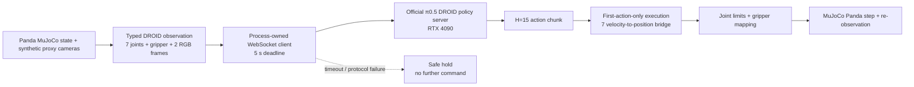

# Stage 16 - Interview package

## One-sentence project statement

Built and evaluated a bounded VLA-to-robot runtime around the official OpenPI
π0.5 DROID policy: typed observations, process-owned WebSocket deadlines,
action safety limits, and a MuJoCo Panda integration path were validated without
claiming unsupported cross-embodiment manipulation skill.

## Architecture

## Evidence to present

| Question | Evidence |
| --- | --- |
| Can the policy be deployed behind a robot runtime? | Official checkpoint/server/client smoke plus typed request validation. |
| How do you prevent stale commands? | A process owns the socket; an unconfirmed deadline terminates it and requires reconnection. |
| What is the latency regime? | Cold warm-up ~33.9 s; warm 200-request mean/p95 RTT 82.61/88.15 ms. |
| Does the simulator integrate with the model? | Live H=15 response, first-action bridge, and 5-cycle + 200-cycle re-observation loops. |
| Did it manipulate successfully? | No: 0/5 on IK-reachable Panda reach targets. This is an explicit negative transfer result. |

## The critical engineering decision

Do not enable execution immediately after model load. A first request exceeded a
5-second deadline and correctly produced one safe hold with zero Panda actions.
After no-control warm-up, the same bounded interface sustained 200/200
synthetic-input cycles without safe holds. This turns a model-startup fact into
a concrete deployment runbook.

## Interview narrative (90 seconds)

1. Start with the problem: an inference server alone is not a robot controller;
   observation schema, transport ownership, deadlines, action semantics and
   safety behavior must be explicit.
2. Explain the boundary: I used official OpenPI π0.5 DROID inputs and outputs,
   but kept all embodiment mapping under my runtime's control.
3. Give the failure case: first JAX request took ~34 seconds; the process-owned
   deadline safely held instead of allowing an ambiguous delayed command.
4. Give the warm result: 200 request/re-observation cycles averaged 82.61 ms
   RTT with no transport failures under controlled synthetic variations.
5. Close with honesty: the Panda task is solvable by an IK oracle, but π0.5
   bridge evaluation scored 0/5. The system works; uncalibrated DROID-to-Panda
   transfer does not. The next research need is matched embodiment data,
   calibrated cameras and a reviewed Panda action representation.

## Expected follow-up questions

- **Why a process instead of a thread for timeout?** A blocked synchronous
  WebSocket thread cannot prove its request was cancelled; killing the socket
  owner avoids accepting a stale response after a timeout.
- **Why execute only the first action?** The model action horizon is not a
  commitment horizon. Re-observing after one action limits accumulated state
  error and makes the controller's choice explicit.
- **Why is 0/5 a useful result?** The target is independently reachable by IK,
  and the full stack is stable. It isolates the missing ingredient as embodied
  data/calibration rather than falsely attributing failure to a broken runtime.
- **What would be required before physical deployment?** Calibrated cameras,
  Panda SDK/controller integration, coordinate and unit validation, hardware
  limits, emergency-stop semantics, operator review and a matched data/policy
  evaluation.

## Boundaries for every presentation

Never state or imply physical robot control, real-camera validation, calibrated
Panda perception, task success, safety certification, or DROID-to-Panda
transfer. State precisely that this project validates an observable, bounded
VLA-to-simulator systems path and documents its transfer limitation.
